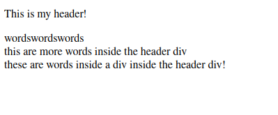
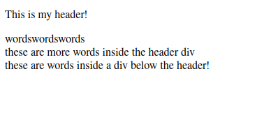

# Exam 1
Drew Bonde

---
## Q1 : Discuss in detail the concept of DOM for an HTML page. **(5 points)**
The HTML DOM, or document object model, is a tree of objects that acts as a programming interface for HTML. It defines all HTML elements, their respective properties and events, and every method to access each element. [^1]
> I.e. this is how one modifies HTML elements.

[^1]: JavaScript HTML DOM, https://www.w3schools.com/js/js_htmldom.asp

## Q2 : Comment on the following statement, "Learning HTML is more about learning the semantic than the syntax." Explain your answer withthe help of an example use-case scenario. **(5 points)**
* Personally, I feel like this isn't as deep as it initially comes off to be. Semantic tags are simply tags that describe their contents for the sole purpose(s) of readability and convenience. So by learning the semantic, you learn how to structure your page in a cleaner, more efficient, and sometimes reusable manner.
For example:
1. Setting up a `<div>` as a header involves this managing/balancing act, where this `<div>` acts as a wrapper for virtually everything that appears under it.
```html
<body>
    <div id="header">
        <p>This is my header!</p>
        <div id="inner-content">
            wordswordswords
        </div>
        <div id="more-inner-content">
            these are more words inside the header div
            <div id="inner-inner-content">
                these are words inside a div inside the header div!
            </div>
        </div>
    </div>
</body>
```


(yes, there is a typo but I am NOT cropping another image rn lol)

2. Instead of implementing the above, why not just use the `<header>` tag?
```html
<body>
    <header id="page-header">
        <p>This is my header!</p>
    </header>
    <div id="inner-content">
        wordswordswords
    </div>
    <div id="more-inner-content">
        these are more words inside the header div
        <div id="inner-inner-content">
            these are words inside a div below the header!
        </div>
    </div>
</body>
```


> Obviously, these code blocks produce identical output. However, the code block presenting the implementation of the `<header>` tag is much easier on the eyes.
* Other semantic tags have similar use cases.

## Q3 : What is the correct usage of the following HTML5 semantic elements: `<article>`, `<footer>`, `<header>`, `<section>`, and `<main>`? **(5 points)**
I'll just be listing these off in bullet points.
* `<article>`
    * Basically any standalone container.
        * "If you do not require any further explaination and is kind of self contained...then you put it inside of `<article>`." [^2]
* `<footer>`
    * This really just defines a footer for a page.
        * A block of anything defined that will appear at the *bottom* of the page.
* `<header>`
    * The same thing as the footer but at the top of the page. 
        * A block of anything defined that will appear at the *top* of the page.
* `<section>`
    * "`<section>`s just split up pages. Everything enclosed in the `<section>` tag is correlated." [^3]
* `<main>`
    * Indicates that the content enclosed is the main content of the page.

[^2]: Professor Sen (during lecture)
[^3]: Professor Sen again (during lecture)

## Q4 : Write the HTML5 code snipped to embed an audio file and a video file in your webpage. What are the acceptable audio formats for embedding on a webpage? **(5 points)**
```html
<audio src="./path/to/audio-file.mp3" controls>
    A sample of an audio file on this page.
</audio>
<video
    src="./path/to/video.webm"
    width="35%"
    controls
    autoplay
    loop
>
    A sample of a video file.
</video>
```
Supported audio extensions:[^4]
* .mp3
* .wav
* .ogg

[^4]: HTML `<audio>` Tag, https://www.w3schools.com/tags/tag_audio.asp

Supported video extensions:
> So this one is interesting, and I can't figure out which one is the case. During lecture you gave us a list that differs from nearly everything else I found on the internet:
* .avi
* .mov
* .mp4
* .webm
> And here is the list from nearly every source I could find:[^5]
* .mp4
* .webm
* .ogg

[^5]: (There were a ton of options, but here is w3schools for example) HTML `<video>` Tag, https://www.w3schools.com/tags/tag_video.asp

> I also ripped this code snippet from what we did in class, let me know if that will be an issue in the future.

## Q5: What is the difference between `<figure>` and `` tags? **(3 points)**
* The `` tag is for embedding an actual image into a page, whereas the `<figure>` tag "semantically organizes"[^6] the image contained within onto the page. 

[^6]: HTML5 - When to use `<figure>`, https://www.learningjournal.guru/article/html5/html5-when-to-use-figure-tag/

## Q6: What is the difference between Block display elements and inline display elements? Give examples of each. **(2 points)**
* When block tags are rendered, the browser puts a newline character at the end of it.

Some block display elements:[^7]
```html
<p>
<div>
<header>
<main>
```
* When inline tags are used, the elements will be rendered side by side.

Some inline display elements:[^7]
```html
<span>

<button>
<script>
```

[^7]: HTML Block and Inline Elements, https://www.w3schools.com/html/html_blocks.asp

## Q7 : What are meta tags used for? Briefly describe at least 3 of them? **(5 points)**
* Meta tags are used for defining information about your page or information about the content on your page.
1. `<meta name="title">` [^8]
    * Defines the title of a page, shows in page tab at the top of the web browser or on a search engine
2. `<meta name="description">` [^8]
    * Defines a description of a page, displayed below the title in a search engine.
3. `<meta name="author">` [^8]
    * Defines the author of a page

[^8]: HTML `<meta>` Tag, https://www.w3schools.com/tags/tag_meta.asp

## Q8: [OPTIONAL; FOR EXTRA CREDIT ONLY; 10 points.]
PROBLEM:

The problem, which I want you all to solve, is, given a “big picture” image like the first ikea picture above, I want you to develop only using HTML5 a webpage wherein if a user, for example, clicks on the couch area of the image, the page will (redirect to) say that “This is a couch”. If they click on, say for
example, the table, the page will say that this is a table. You don’t need to specifically use this ikea image. I included this only to illustrate the problem and motivate the practicality of the web system design. For your solution, you may use a much simpler image. However, the idea is it should have at least 3 distinct products, and if a user clicks on a product, the page should mention what product is it (or you can give a href redirect to a page that describes the product if available).

WHAT IS EXPECTED IN YOUR SOLUTION:
* Your problem-solving approach: document step-by-step as bulleted-list, as you read this problem and understand it, what is your strategy (where to start? How will you apply what you know? Where will you look for information that will aid you to solve this? What does the blueprint of your solution look like, etc.) to solve this problem. [3 points]
* Your HTML code [screenshot of code editor] and the image that you used included in your final PDF answer document. [7 points]

---
Okay! So this is probably "cheating", but I worked as a web developer in the past for a little over a year, and we used image maps all the time!

Here was my thinking process:
* I saw that we needed to make certain parts of an image clickable, so I immediately decided to use `<map>`s
* I needed to find an image of a living room that isn't very busy
* I needed simple pages for each clickable item in the image
* And finally, a back button in each of those simple pages for convenience.
> all this being said, if I needed to look for information to solve this, I would go straight to w3schools.com bc that website carried me through all my classes and my jobs lol

### Code for the Main Page:
```html
<!DOCTYPE html>
<html lang="en">
<head>
    <meta charset="UTF-8">
    <meta http-equiv="X-UA-Compatible" content="IE=edge">
    <meta name="viewport" content="width=device-width, initial-scale=1.0">
    <title>Document</title>
</head>
<body>
    
    <map name="roommap">
        <area shape="rect" coords="675, 289, 1125, 636" href="couch.html">
        <area shape="rect" coords="674, 479, 78, 286" href="couch.html">
        <area shape="rect" coords="78, 480, 134, 549" href="couch.html">
        <area shape="circle" coords="360, 529, 55" href="table.html">
        <area shape="circle" coords="260, 529, 55" href="table.html">
        <area shape="circle" coords="460, 529, 55" href="table.html">
        <area shape="rect" coords="570, 0, 997, 279" href="shelf.html">
    </map>
</body>
</html>
```

### The Rest of The Pages:
`couch.html`, `table.html`, and `shelf.html` all follow this format.

```html
<!DOCTYPE html>
<html lang="en">
<head>
    <meta charset="UTF-8">
    <meta http-equiv="X-UA-Compatible" content="IE=edge">
    <meta name="viewport" content="width=device-width, initial-scale=1.0">
    <title>Document</title>
</head>
<body>
    <p>This is a(n) item!</p>
    <hr />
    <a href="extra-credit.html">Back</a>
</body>
</html>
```

### The Picture I Used


<br />
<br />
<hr />

#### Citations