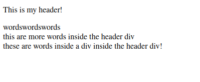
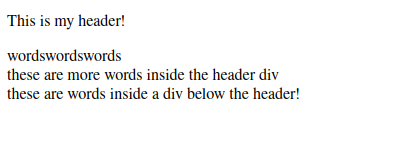

# Exam 1
Drew Bonde

---
## Q1 : Discuss in detail the concept of DOM for an HTML page. **(5 points)**
The HTML DOM, or document object model, is a tree of objects that acts as a programming interface for HTML. It defines all HTML elements, their respective properties and events, and every method to access each element. [^1]
> I.e. this is how one modifies HTML elements.

[^1]: JavaScript HTML DOM, https://www.w3schools.com/js/js_htmldom.asp

## Q2 : Comment on the following statement, "Learning HTML is more about learning the semantic than the syntax." Explain your answer withthe help of an example use-case scenario. **(5 points)**
* Personally, I feel like this isn't as deep as it initially comes off to be. Semantic tags are simply tags that describe their contents for the sole purpose(s) of readability and convenience. So by learning the semantic, you learn how to structure your page in a cleaner, more efficient, and sometimes reusable manner.
For example:
1. Setting up a `<div>` as a header involves this managing/balancing act, where this `<div>` acts as a wrapper for virtually everything that appears under it.
```html
<body>
    <div id="header">
        <p>This is my header!</p>
        <div id="inner-content">
            wordswordswords
        </div>
        <div id="more-inner-content">
            these are more words inside the header div
            <div id="inner-inner-content">
                these are words inside a div inside the header div!
            </div>
        </div>
    </div>
</body>
```


2. Instead of implementing the above, why not just use the `<header>` tag?
```html
<body>
    <header id="page-header">
        <p>This is my header!</p>
    </header>
    <div id="inner-content">
        wordswordswords
    </div>
    <div id="more-inner-content">
        these are more words inside the header div
        <div id="inner-inner-content">
            these are words inside a div below the header!
        </div>
    </div>
</body>
```


> Obviously, these code blocks produce identical output. However, the code block presenting the implementation of the `<header>` tag is wasy easier on the eyes.