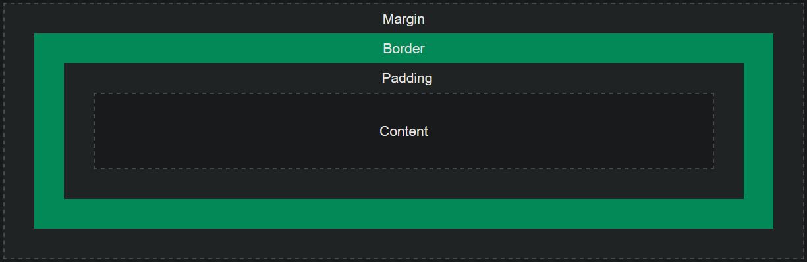

# Exam 2
Drew Bonde

<br>

## Q1. With the help of a diagram, explain what the box model in CSS is. Which CSS properties are a part of the box model? **(5 points)**

---
The box model is a box that wraps around every HTML element, and the CSS properties that are part of the box model are: margins, borders, and padding.[^1] Here is a diagram from w3schools.com [^1] to help illustrate this point.



[^1]: https://www.w3schools.com/css/css_boxmodel.asp

<br>

## Q2. What are the three distinct ways in which you can embed CSS in your webpage. Explain your answer with the help of HTML-CSS code syntax. **(5 points)**

---
The three ways to embed CSS are: [^2]
1. Inline
2. Internal
3. External

Inline CSS is defined with the `style` attribute inside HTML elements. Embedding it this way is as follows:
```html
<p style="color:blue;">This is a blue paragraph made with the p tag, colored with inline CSS</p>
```

Internal CSS is defined within the `<style>` tag inside the `<head>` tag. Using it is as follows:
```html
<head>
    <style>
        <!--any desired css falls here.--> 
        <!--for the sake of example, i will show the same styling i did with inline css-->
        
        p   {color: blue;}
    </style>
</head>
```

External CSS is using an external file to define the style for a webpage. A `<link>` tag is placed under the `<head>` tag to link to it. Doing it this way is as follows:

This is the stylesheet.
```css
p {
    color: blue;
}
```

And here is the HTML.
```html
<head>
    <link rel="stylesheet" href="./path/to/stylesheet">
</head>
```

[^2]: https://www.w3schools.com/html/html_css.asp

<br>

## Q3. Which HTML elements the following CSS codes style? **(5 points)**
* i. *{color:”red”;}
* ii. #container{margin: 0px;}
* iii. .container{background-color: “purple”;}
* iv. ul li {color: “red”;}
* v. .container>p{color: “white”;}
* vi. p + p {margin-top: 0;}
* vii. h2 ~ p {margin-left: 5px;}
* viii. input [type=”text”]{width: 30px;}
* ix. .container, .menu {background-color: “gray”;}

---
* i. ALL text
* ii. HTML elements with `id=container`
* iii. HTML elements with `class=container`
* iv. all `<li>`s inside of `<ul>`s
* v. Only paragraphs that are children of elements of the `container` class.
* vi. The first `<p>` after `<p>` elements.
* vii. Every `<p>` element  preceded by an `<h2>` element.
* viii. Only `<input>` elements with the `type=text` attribute.
* ix. All elements of `class="container"` and `class="menu"`

<br>


## Q4. Write a CSS code snippet that will make a webpage styling responsive to different devices i.e. the webpage will present itself in a particular way depending on the amount of browser space available ( for e.g. viewing using a standard desktop computer vs. viewing using a mobile device). **(5 points)**

---
Essentially, all we need for this is `@media` and to define the `max-width` attribute. (I suppose `max-height` could be configured but I can't really think of a reason to do that instead of `max-width`.)
```css
@media (max-width 768px) {
    .element1 {
        //code to make element 1 look a certain way when the screen is 768 px or lower
    }

    .element2 {
        //code to make element 2 look a certain way when the screen is 768 px or lower
    }
    .....
}
```

## Q5. For the CSS property display, what is the difference between its values `block`, `inline-block`, and `inline`? **(3 points)**

---
So `block` makes the element behave like a block element, i.e. it creates a newline and has 100% width. `inline` makes the element behave like an inline element, i.e. akin to a `<span>` element. `inline-block` is formatted exactly like an inline element, but height and width values can be applied to it.[^3]

[^3]: https://www.w3schools.com/cssref/pr_class_display.php

<br>

## Q6. Explain the concept of cascading in cascading style sheets. How can you override the default cascading behavior in CSS? **(2 points)**

---
AFAIK the concept of cascading refers to the idea that styling "cascades" down from several rules. So the whole point is when an attribute has more than one styling rule, which one takes priority?

To override default cascading behavior in CSS, you can give an attribute an `!important` declaration. Or if you want to get specific, if an attribute falls under a specific `id` and `class`, the styles for the `id` take priority so keep that in mind.

<br>

## Q7. What are pseudo elements and pseudo classes in CSS? Give a syntactical example of a use-case scenario for each concept. **(5 points)**
Pseudo-classes are essentially used to define special states of elements.[^4] For example, if we have list items that we want to color in when we hover over them, we would use the `:hover` pseudo-class.
```css
li:hover {
    display: inline-block;
    background-color: blue;
}
```

[^4]: https://www.w3schools.com/css/css_pseudo_classes.asp

Pseudo-elements are essentially really specific things about HTML elements. For example, if we want to style the first sentence of a paragraph, we would use the `::first-sentence` pseudo-element.
```css
p::first-sentence {
    color: blue;
}
```

<br>
<br>
<br>
<br>

### Citations