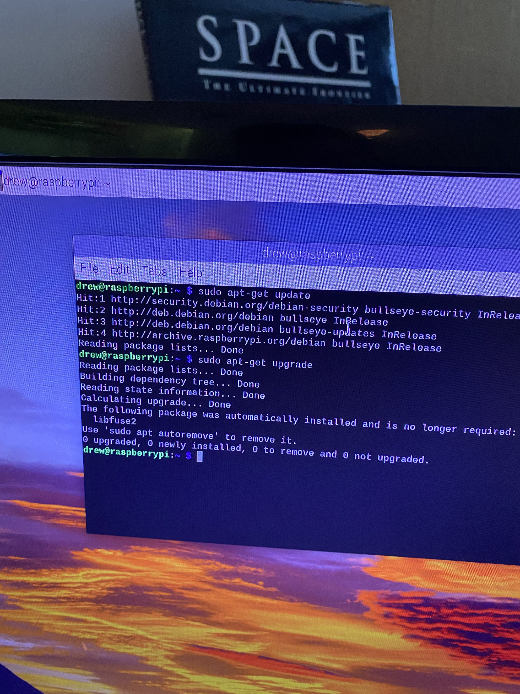

# Assignment 1
Drew Bonde

> quick little sidenote, I will submit my code files along with this pdf in the .zip, but i will be leaving code blocks in here for the sake of looking pretty lol

> one more thing!! i used outside resources for two lines of code. the citations are in the code (`Bonde_a1.py`)

## Part 1.
This part focuses on the Raspberry Pi setup, you need to provide the screenshot and the picture that you have from your Raspberry Pi setup.

### a. (10 points) Paste the screenshot demonstrating that you successfully completed the updates and upgrades on your Raspberry Pi.


### b. (10 points) Take a picture of your setup (with the keyboard, monitor, and Pi or Laptop) that you used to connect to your Pi. Paste it here.


---
## Part 2.
This assignment is intentionally open-ended to allow you to explore with some creativity. This assignment will be used in building toward your final project at the end of the semester.

### a. (10 points) A paragraph on how your setup could be used in a real-world environment.
I decided to use the joystick built into the SenseHat as I cannot afford to purchase practically anything right now. My program senses which direction the joystick is being pushed and displays it on the SenseHat LED matrix. In my opinion, this specific project doesn't have too many uses in the real world. However, you can use this to see if a controller joystick is functioning properly, or you could use this to sense input for a game (i.e. to move a character, select options, etc.)

### b. (35 points) A video file showing you triggering the sensor and the actuator responding
> I have submitted the video file within .zip. See (`IMG_6016.mov`)

### c. (35 points) All source code to run your project, including a README if you changed any system configurations.
The code:
```python
from sense_hat import SenseHat
white = (255,255,255)
sense = SenseHat()

print("\nPress Ctrl+c to quit.")

while True:
    # I used raspberrypi.org's page about the sensehat joystick to see how to access the events (see 'for event in sense.stick.get_events():'
    # https://projects.raspberrypi.org/en/projects/getting-started-with-the-sense-hat/9
    for event in sense.stick.get_events():
        # So this was all working properly, but each time the joystick was pressed and released, the message would display twice.
        # I concluded that it was displaying a message each time the joystick was pressed and it would display again when it was released.
        # So I found 'event.action == pressed" on a forum, which is exactly what I needed.
        # https://forums.raspberrypi.com/viewtopic.php?t=240977
        if event.action == 'pressed':
            if event.direction == 'left':
                sense.show_message("LEFT")
            elif event.direction == "right":
                sense.show_message("RIGHT")
            elif event.direction == "up":
                sense.show_message("UP")
            elif event.direction == "down":
                sense.show_message("DOWN")
            elif event.direction == "middle":
                sense.show_message("MIDDLE")
```

> The README.md is also included in the .zip.